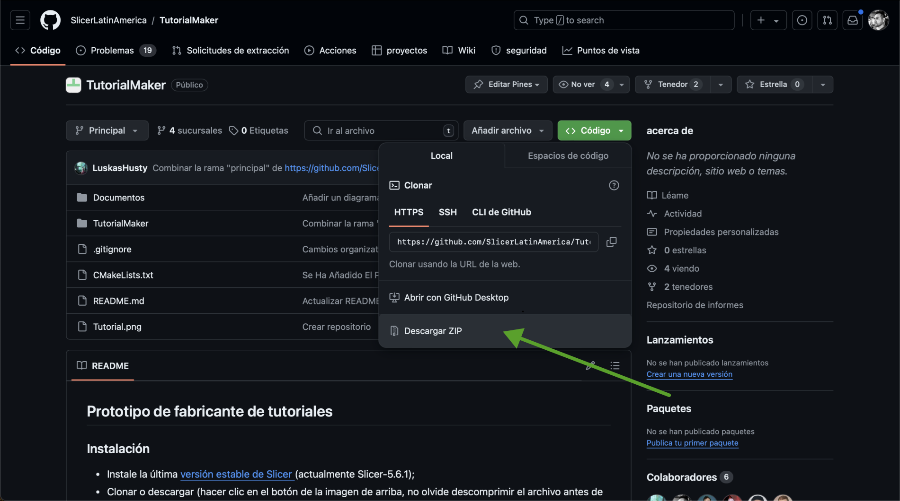
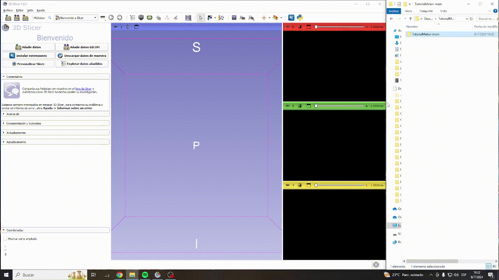

# Tutorial Maker
Tutorial Maker es una extensión de 3D Slicer para agilizar la creación de tutoriales de 3D Slicer en multiples lenguajes. Las secciones siguientes  proporcionan una guia de usuario de la herramienta.

## Instalación (Mediante el Manejador de Extensiones)

- Instale [3D Slicer versión 5.10.0](https://download.slicer.org) o [última versión estable de 3D Slicer](https://download.slicer.org)
- Abra el "Manejador de Extensiones" y coloca en el buscador "TutorialMaker".

- Instala la extensión, cuando termine la instalación haga clic para reiniciar 3D Slicer para cargar la extensión.

- Continua a [**Como usar TutorialMaker**](#cómo-utilizar-tutorial-maker)

## Instalación (Manual)

Siga estos pasos si desea obtener la última versión de la extensión antes de la compilación preliminar (que se realiza por la mañana aproximadamente a las 9 EST).

### Recomendamos encarecidamente desactivar el modo de desarrollador, ya que utiliza funciones que actualmente están en desarrollo y pueden fallar durante el uso de la extensión.

- Instale [3D Slicer versión 5.10.0](https://download.slicer.org) o [última versión estable de 3D Slicer](https://download.slicer.org)
- Abra el repositorio [Tutorial Maker](https://github.com/SoniaPujolLab/SlicerTutorialMaker/tree/main) en GitHub
- Clone el botón verde “Código” y seleccione la opción “Descargar ZIP” como se muestra en la imagen de abajo para descargar el archivo “TutorialMaker.zip” en su computadora.

- Descomprima el archivo “TutorialMaker.zip” para acceder al directorio “TutorialMaker-main”

- **Para usuarios de Windows**:
    1. Inicie 3D Slicer.
    2. Arrastre y suelte la carpeta “TutorialMaker” en la ventana de la aplicación de Slicer.
    3. Aparecerá una primera ventana emergente, “Seleccionar un lector”. Seleccione “Añadir módulos de scripting Python a la aplicación” y haga clic en OK.
    4. Aparece una segunda ventana emergente para cargar el módulo Tutorial Maker. Haga clic en “Sí”.
    

- **Para usuarios de MacOs**:
    1. Inicie 3D Slicer.
    2. Seleccione “Editar” en el menú principal.
    3. Seleccione “Parámetros de la aplicación”.
    4. Aparecerá una ventana de “Parámetro”': seleccione “Módulos” en el panel izquierdo.
    5. Seleccione el archivo 'TutoriaMaker.py'.
    6. Arrastre y suelte el archivo TutorialMaker.py situado en el subdirectorio TutorialMaker-main/TutorialMaker/'en el campo “Rutas de módulos adicionales” y haga clic en OK para reiniciar Slicer.
    

## Cómo utilizar Tutorial Maker

- Seleccione el módulo “Tutorial Maker” en la categoría “Utilidades” de la lista de módulos de Slicer.

> [!ADVERTENCIA]
> Antes de empezar este tutorial, cambie Slicer al modo de pantalla completa y ajuste el tamaño de la fuente a 14pt para asegurarse de que las capturas de pantalla son fáciles de leer.

- Seleccione `fourMin_tutorial`

- Dé click en `Capture Screenshots` y siga las instrucciones para cerrar la escena y cerrar la consola de Python

- Después de capturar el tutorial, haz clic en `Edit annotations`.

### Herramienta de anotaciones

- Las capturas de pantalla aparecerán a la izquierda.

- Cada captura de pantalla tiene un título (flecha verde) y un comentario (flecha roja).

- Seleccione una de las cuatro herramientas de anotación.

- Después de seleccionar una herramienta, especifique el estilo.

- A continuación, haga clic en el elemento que recibirá la anotación y empieza a escribir.

- Después de crear todas las anotaciones, haz clic en `Save File`.

Las capturas de pantalla con anotaciones ahora se guardan en la carpeta Módulo en Salidas, dentro de la carpeta de instalación de la extensión.

- Presiona en `Generate Tutorial` para generar los archivos MD y HTML.

- Recibiras un mensaje que te avisa que los archivos se han generado. 

- La extensión abrirá la carpeta que contiene las capturas de pantalla anotadas, y también el HTML y MD.

- También puedes cambiar el diseño desde el anotador, arrastrando los menús.

- Es posible cambiar el título y las descripciones de las diapositivas.

## Modo de Desarrollador 
- Si ha habilitado el modo de desarrollador (Editar > Configuración de la aplicación > Desarrollador > Habilitar modo de desarrollador) en Slicer, es posible que observe opciones adicionales dentro de la extensión. Estas representan funciones experimentales y procesos inestables que se encuentran actualmente en fase de prueba.

- La función "Obtener de GitHub" permite a los usuarios descargar tutoriales directamente desde una lista seleccionada de repositorios externos. Actualmente, esta función está deshabilitada para evitar problemas relacionados con los límites de velocidad de la API de GitHub.

- Herramientas de creación de tutoriales: Estas funciones facilitan el desarrollo de nuevos tutoriales, ya que permiten registrar automáticamente los nombres y las rutas de los widgets.

### Escribir tutoriales
- Para obtener orientación sobre el desarrollo de sus propios tutoriales, siga la plantilla y los ejemplos alojados en SlicerTestRepository (https://github.com/SoniaPujolLab/SlicerTestTutorial)
