# Slicer Tutorial Maker

O Slicer Tutorial Maker é uma extensão para o 3D Slicer que facilita a criação de tutoriais ilustrados em múltiplos idiomas. Ele automatiza a captura de capturas de tela, oferece um editor visual de anotações e exporta os tutoriais finalizados nos formatos HTML e Markdown.

[English Documentation](https://github.com/SoniaPujolLab/SlicerTutorialMaker/blob/main/README.md)
[Documentación en español](https://github.com/SoniaPujolLab/SlicerTutorialMaker/blob/main/README_esp.md)

---

## Sumário

1. [Instalação: Gerenciador de Extensões](#instalação-gerenciador-de-extensões)
2. [Instalação: Manual / Desenvolvedor](#instalação-manual--desenvolvedor)
3. [Como Usar o Tutorial Maker](#como-usar-o-tutorial-maker)
   - [1. Selecionar um Tutorial](#1-selecionar-um-tutorial)
   - [2. Capturar Capturas de Tela](#2-capturar-capturas-de-tela)
   - [3. Anotar o Tutorial](#3-anotar-o-tutorial)
   - [4. Gerar o Tutorial](#4-gerar-o-tutorial)
4. [Ferramenta de Anotação](#ferramenta-de-anotação)
   - [Atalhos de Teclado](#atalhos-de-teclado)
5. [Modo Desenvolvedor](#modo-desenvolvedor)
6. [Escrevendo Tutoriais](#escrevendo-tutoriais)
7. [Desinstalação](#desinstalação)

---

## Instalação: Gerenciador de Extensões

1. Instale o [3D Slicer 5.10.0](https://download.slicer.org/) ou a [versão estável mais recente](https://download.slicer.org/).
2. Abra o **Gerenciador de Extensões** e pesquise por `TutorialMaker`.
   

3. Clique em **Instalar** e reinicie o Slicer quando solicitado.
   

4. Prossiga para [**Como Usar o Tutorial Maker**](#como-usar-o-tutorial-maker).

---

## Instalação: Manual / Desenvolvedor

Siga estas etapas para usar a versão de desenvolvimento mais recente antes que ela apareça no build do Gerenciador de Extensões (publicado todas as manhãs por volta das 9h EST).

> [!WARNING]
> Recomendamos fortemente manter o **Modo Desenvolvedor desativado**, a menos que você esteja desenvolvendo ativamente a extensão. O Modo Desenvolvedor expõe funcionalidades experimentais que podem causar instabilidade.

1. Instale o [3D Slicer Stable Release](https://download.slicer.org/) ou o [Preview Release](https://download.slicer.org/).
2. Abra o [repositório TutorialMaker no GitHub](https://github.com/SlicerLatinAmerica/TutorialMaker).
3. Clique no botão verde **Code** e selecione **Download ZIP** para baixar o arquivo `TutorialMaker.zip`.
4. Extraia o arquivo para obter o diretório `TutorialMaker-main`.

**Windows**

1. Inicie o 3D Slicer.
2. Arraste e solte a pasta `TutorialMaker` na janela do aplicativo Slicer.
3. Na janela **Select a reader**, escolha **Add Python scripted modules to the application** e clique em **OK**.
4. Quando perguntado sobre carregar o módulo Tutorial Maker, clique em **Yes**.

**macOS / Linux**

1. Inicie o 3D Slicer.
2. Acesse **Edit → Application Settings → Modules**.
3. No campo **Additional module paths**, arraste e solte o arquivo `TutorialMaker.py` localizado dentro do diretório `TutorialMaker-main/TutorialMaker/`.
4. Clique em **OK** e reinicie o Slicer.

---

## Como Usar o Tutorial Maker

### 1. Selecionar um Tutorial

Abra o módulo **Tutorial Maker** na categoria **Utilities** no seletor de módulos do Slicer.

> [!IMPORTANT]
> Antes de capturar as capturas de tela, alterne o Slicer para o modo **Tela Cheia** e defina o tamanho da fonte do aplicativo para **14 pt** para garantir que as capturas de tela sejam fáceis de ler.

Selecione o tutorial desejado na lista, por exemplo `FourMinuteTutorial`.

---

### 2. Capturar Capturas de Tela

Clique em **Capture Screenshots**. Um diálogo de preparação será exibido antes do início da captura.

O diálogo **Screenshot Capture Environment Setup** oferece três opções:

| Opção | Padrão | Descrição |
|-------|--------|-----------|
| Save current scene data | Desativado | Abre o diálogo Salvar Dados para que você possa preservar seu trabalho antes de a cena ser limpa. |
| Maximize 3D Slicer window for screen capture | Ativado | Garante dimensões de captura de tela consistentes em todos os slides. |
| Close Python console and Error Log window | Ativado | Oculta painéis de desenvolvedor para capturas de tela mais limpas. |

> [!WARNING]
> A cena atual sempre será limpa antes do início da captura, independentemente das opções escolhidas.

Clique em **OK** para prosseguir. Um diálogo de progresso acompanhará cada etapa da captura e exibirá uma mensagem pedindo para não interagir com o Slicer até que a captura seja concluída.

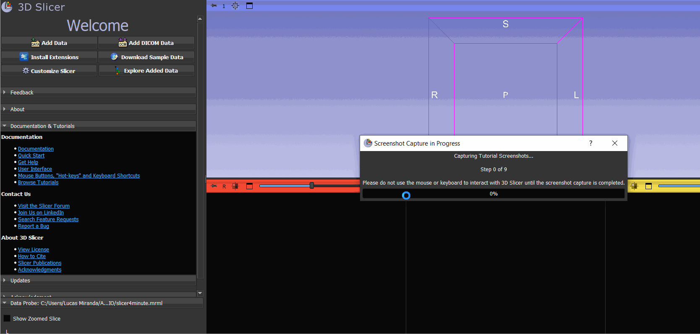

Quando a captura for concluída, o Slicer retorna ao módulo Tutorial Maker e exibe uma confirmação:

> **Screenshot Capture Completed:** *Captured Tutorial: `<nome do tutorial>`*

---

### 3. Anotar o Tutorial

Após capturar as capturas de tela, o painel exibe dois botões lado a lado:

| Botão | Comportamento |
|-------|---------------|
| **Edit Annotations** | Abre o Anotador sem anotações carregadas. Use este botão para começar a anotar do zero ou para descartar completamente o trabalho anterior. |
| **Resume Annotations** | Abre o Anotador **e recarrega automaticamente** o arquivo `annotations.json` salvo mais recentemente para o tutorial selecionado. Use este botão para continuar o trabalho iniciado em uma sessão anterior. |

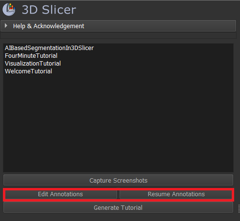

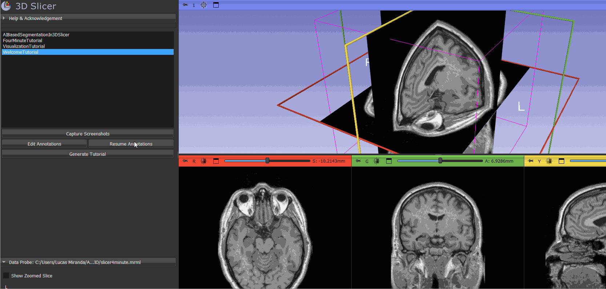

> [!NOTE]
> **Edit Annotations** é habilitado assim que um tutorial é selecionado. **Resume Annotations** só é habilitado quando já existe um arquivo `annotations.json` para o tutorial selecionado (ou seja, você salvou ao menos uma vez). Quando habilitado, ele restaura todas as anotações (rótulos, posições, estilos, títulos e descrições dos slides) exatamente como você deixou.

---

### 4. Gerar o Tutorial

Após salvar suas anotações, clique em **Generate Tutorial** para produzir os arquivos HTML e Markdown finais.

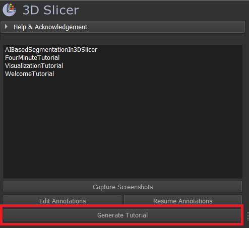

Se nenhum arquivo de anotações for encontrado, você verá um aviso:

> **No Annotations Found:** *You don't have any annotations to export. Please annotate your screenshots first using "Edit Annotations".*

Quando a geração for concluída com sucesso, o Slicer abre a pasta de saída automaticamente e exibe uma confirmação:

> **Tutorial Generated:** *Generated Tutorial: `<nome do tutorial>`*

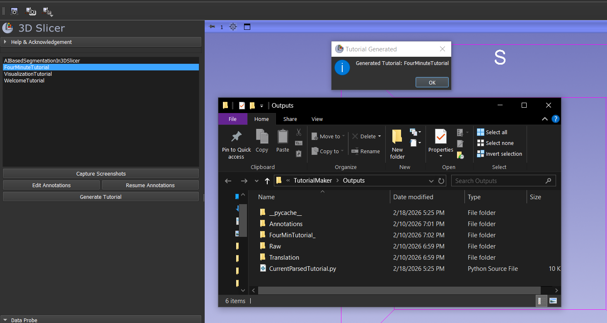

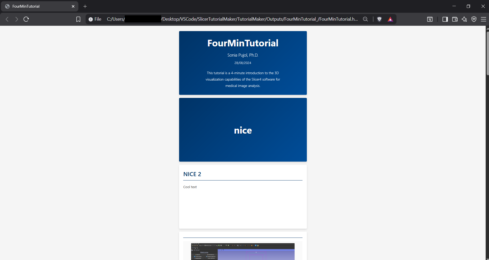

---

## Ferramenta de Anotação

A janela do Anotador é aberta como uma janela modal separada.

A faixa de miniaturas à esquerda exibe todos os slides capturados. Clique em qualquer miniatura para selecioná-la.

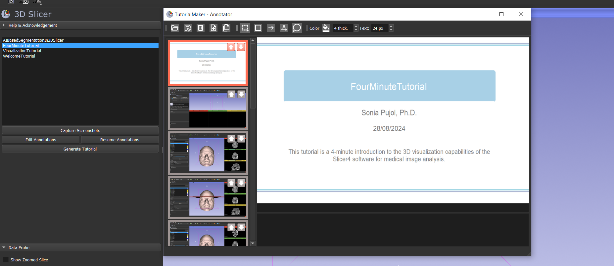

**Editando o conteúdo dos slides**

Nos slides de captura de tela normais, você pode editar os campos **Title** e **Description** no topo do painel a qualquer momento durante a sessão de anotação.

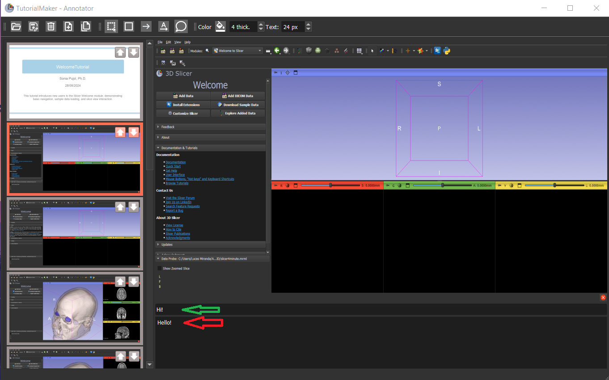

Slides especiais (como o **Cover Slide**) não possuem campos de Título e Descrição. Em vez disso, eles contêm anotações pré-definidas (autor, data, descrição, etc.) que você pode selecionar e editar diretamente no canvas do slide.

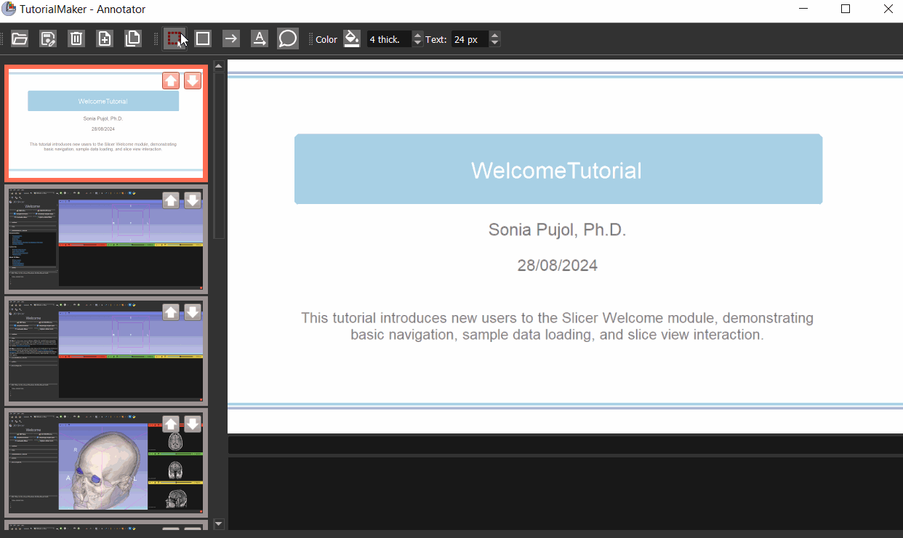

**Adicionando anotações**

1. Selecione uma ferramenta de anotação na barra de ferramentas (Retângulo, Seta, Texto, etc.).
   
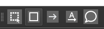

2. Escolha o estilo da anotação (cor, tamanho da fonte, espessura da linha).
   
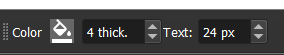

3. Clique na área do slide onde deseja colocar a anotação e digite o rótulo.
   
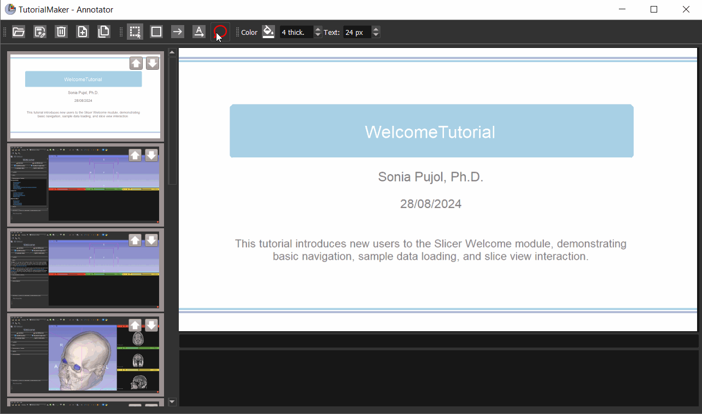

**Salvando**

Clique no botão **Save** na barra de ferramentas para salvar as anotações em `Outputs/Annotations/<nome do tutorial>/annotations.json` dentro da pasta de instalação da extensão.

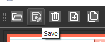

> [!NOTE]
> Ao fechar o Anotador, um diálogo perguntará se você deseja **Salvar**, **Descartar** ou **Cancelar** as alterações não salvas.

**Personalização do layout**

Você pode redimensionar ou reorganizar os painéis arrastando os divisores.

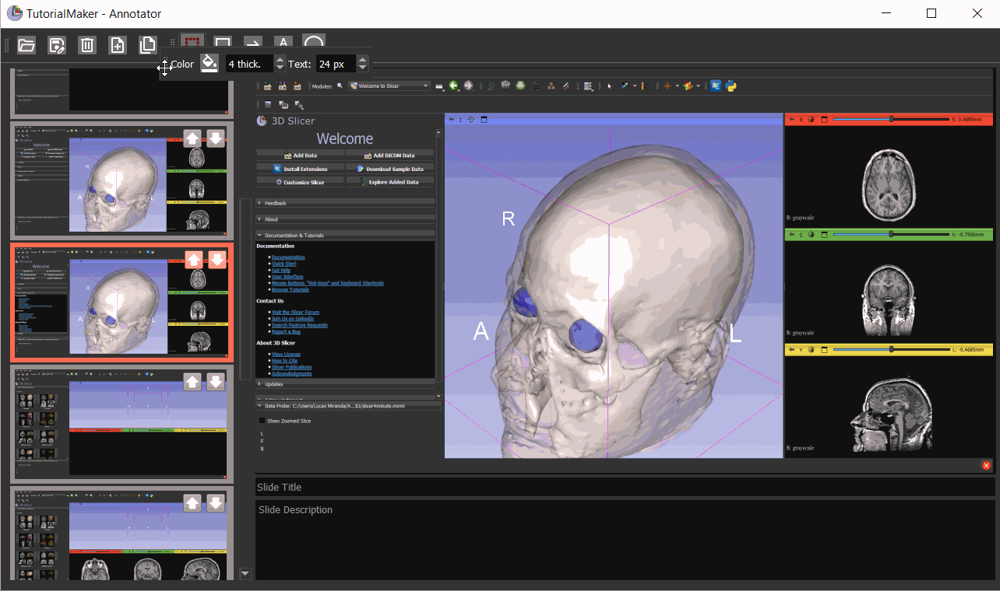

---

### Atalhos de Teclado

Os seguintes atalhos de teclado estão disponíveis enquanto a janela do Anotador estiver em foco:

| Tecla | Ação |
|-------|------|
| `Del` | Exclui a anotação selecionada. |
| `Esc` | Deseleciona a anotação atual sem excluí-la. |
| `Shift` + clique | Coloca uma anotação e **mantém a mesma ferramenta ativa**, permitindo adicionar múltiplas anotações em rápida sucessão sem precisar selecionar a ferramenta novamente. |

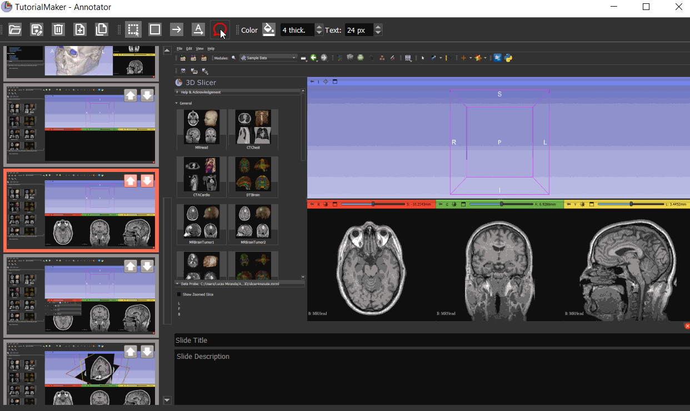

---

## Modo Desenvolvedor

Se o **Modo Desenvolvedor** estiver habilitado no Slicer (**Edit → Application Settings → Developer → Enable developer mode**), opções adicionais aparecerão no painel do Tutorial Maker.

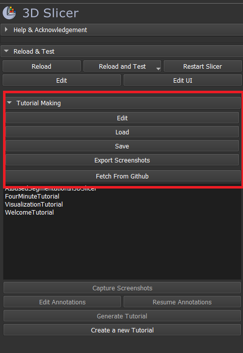

- **Fetch From GitHub:** Baixa scripts de tutoriais diretamente de uma lista curada de repositórios externos. Atualmente desativado por padrão para evitar problemas com os limites de taxa da API do GitHub.
- **Tutorial Creation Tools:** Auxilia no desenvolvimento de novos tutoriais registrando nomes e caminhos de widgets automaticamente.

> [!WARNING]
> Os recursos do Modo Desenvolvedor são experimentais e podem causar instabilidade. Recomendamos fortemente manter o Modo Desenvolvedor desativado para a criação rotineira de tutoriais.

---

## Escrevendo Tutoriais

Para orientações sobre como criar seus próprios scripts de tutorial, siga os modelos e exemplos disponíveis na [SlicerTutorialMakerCollection](https://github.com/SoniaPujolLab/SlicerTutorialMakerCollection).

---

## Desinstalação

### Pelo Gerenciador de Extensões (recomendado)

1. No 3D Slicer, abra **View → Extension Manager** (ou o botão **Extensions Manager** na barra de ferramentas).
2. Acesse a aba **Installed Extensions**.
3. Localize **TutorialMaker** na lista.
4. Clique no botão **Uninstall** (lixeira / remover) ao lado da extensão.
5. Reinicie o 3D Slicer quando solicitado para concluir a remoção.

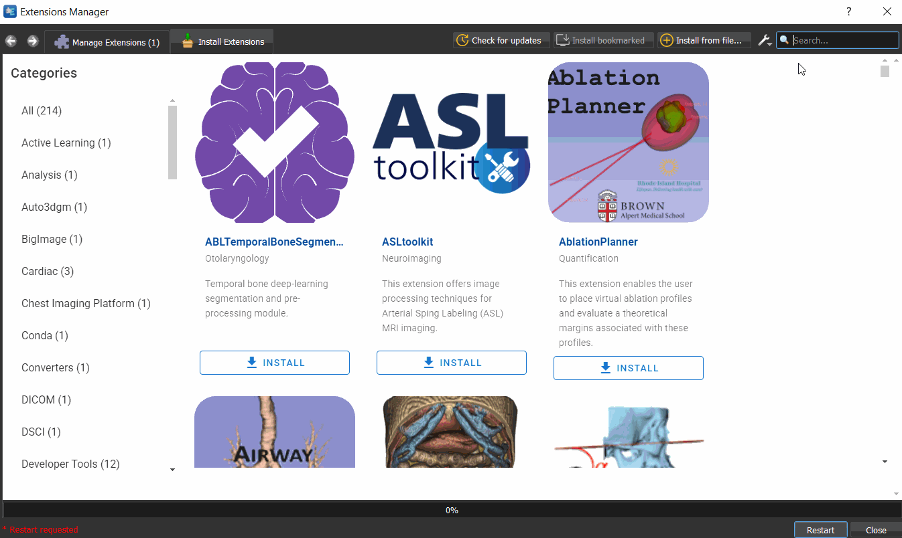

### Remoção manual (instalação por desenvolvedor / código-fonte)

Se você instalou a extensão adicionando-a aos **Additional module paths**, siga estas etapas:

1. Acesse **Edit → Application Settings → Modules**.
2. Na lista **Additional module paths**, selecione a entrada que aponta para a pasta `TutorialMaker` (ou `TutorialMaker.py`).
3. Clique no botão **Remove** (menos) para excluir a entrada do caminho.
4. Clique em **OK** e reinicie o 3D Slicer.
5. Após reiniciar, você pode excluir com segurança o diretório `TutorialMaker-main` do seu sistema de arquivos.

> [!NOTE]
> Remover o caminho do módulo apenas cancela o registro da extensão no Slicer. Você deve excluir manualmente a pasta de origem do disco para remover todos os arquivos.

**Removendo arquivos de saída gerados**

Os arquivos de saída dos tutoriais (capturas de tela, anotações, HTML e Markdown) são armazenados dentro da pasta de instalação da extensão em `TutorialMaker/Outputs/`. Esses arquivos não são removidos automaticamente. Exclua o diretório `Outputs/` manualmente caso não precise mais deles.
